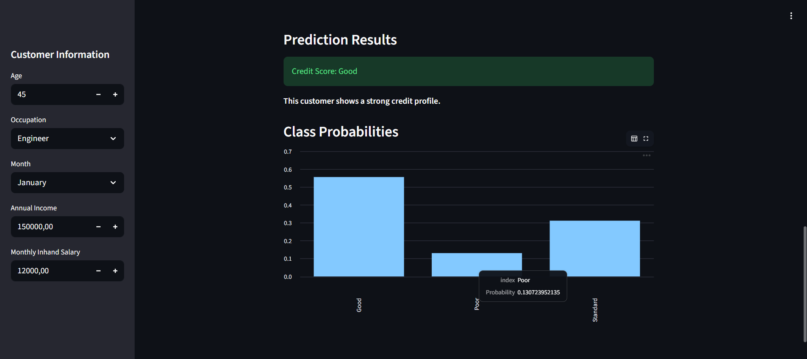
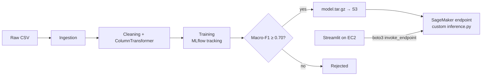

# Credit Score Classification: End-to-End ML on AWS

Classifies a customer's credit score as **Good**, **Standard** or **Poor** from their financial profile and payment history. The project goes from messy raw data to a model served on a **SageMaker real-time endpoint**, with a **Streamlit** front end on **EC2**. Training is tracked with **MLflow**.

**Live demo (Streamlit Cloud):** [credit-score-prediction-virgie.streamlit.app](https://credit-score-prediction-virgie.streamlit.app/) (free hosting sleeps when idle, so it may take ~30 seconds to wake up) · **Demo code:** [Credit-Score-Prediction](https://github.com/virgiequeena/Credit-Score-Prediction)



## Results

The data was 25,000 customer records with 3 imbalanced classes. The test set held 5,000 records: Standard 2,651 / Poor 1,440 / Good 909.

Because the classes are imbalanced, the main metric is **macro-F1**. It weights every class equally, so the minority class **Good** counts as much as the others. Accuracy would mostly reward getting "Standard" right.

| Model | Accuracy | Macro-F1 |
|---|---|---|
| Logistic Regression (baseline) | 0.64 | 0.64 |
| CatBoost | 0.70 | 0.70 |
| LightGBM | 0.72 | 0.71 |
| Random Forest | 0.74 | 0.72 |
| XGBoost | 0.74 | 0.72 |
| **Random Forest (tuned)** | | **0.719** |
| **XGBoost (tuned)** | | **0.721** |

- **Tuning:** the top two models were tuned with `GridSearchCV` (3-fold CV, scored on macro-F1). After tuning they were essentially tied.
- **Precision/recall trade-off:** LightGBM and CatBoost reached higher recall on *Good* (0.82) but at lower precision. Random Forest and XGBoost were the most balanced across all three classes.

## Architecture



1. **Pipeline** (`pipeline/`): the training code is object-oriented, with separate classes for preprocessing, training and evaluation.
   - Every run logs its parameters, metrics and model to MLflow (SQLite backend).
   - A model is only approved for deployment if its test macro-F1 is **≥ 0.70**.
2. **Packaging** (`deploy/deploy_endpoint.ipynb`): the trained scikit-learn pipeline and label encoder are bundled into `model.tar.gz` and uploaded to S3.
3. **Serving** (`deploy/inference.py`): a SageMaker `SKLearnModel` runs on an `ml.m5.large` endpoint with a custom inference script.
   - The script implements SageMaker's `model_fn`, `input_fn`, `predict_fn` and `output_fn` functions.
   - It accepts JSON or CSV input and returns the predicted label plus a probability for each class.
4. **Front end** (`app_streamlit.py`): the app takes customer details through a form, calls the endpoint through `boto3`, and shows the prediction with a class-probability chart.
5. **Hosting** (`deploy/user-data.sh`): the EC2 bootstrap script clones this repo, creates a Python virtual environment, and runs Streamlit as a `systemd` service, so it restarts on failure and on reboot.

## Data & preprocessing

The raw data had many quality issues. All fixes live in `PreprocessingPipeline.clean_data()`, so training and inference apply the same logic.

- **Numbers stored as text:** values like `"1200_"` in `Age`, `Annual_Income`, `Num_of_Loan` and others were converted to numeric.
- **Impossible values:** out-of-range numbers (e.g. age above 100, interest rate above 50%) were set to missing.
- **Placeholder values:** junk entries such as `"_______"`, `"!@9#%8"`, `"_"` and `"NM"` were replaced with missing values.
- **Credit history:** text like `"22 Years and 5 Months"` was parsed into a total number of months.
- **Loan types:** the free-text `Type_of_Loan` field was turned into a count feature, `Num_Loan_Types`.
- **Identifiers dropped:** `ID`, `Customer_ID`, `Name` and `SSN` were removed.

After cleaning, a `ColumnTransformer` applies:
- median imputation and standard scaling to numeric features
- ordinal encoding to `Credit_Mix` (Bad < Standard < Good)
- one-hot encoding to `Occupation`, `Payment_of_Min_Amount` and `Payment_Behaviour`

Missing values are imputed **after** the train/test split, so no information from the test set leaks into training.

## Repository structure

```
├── app_streamlit.py          # Streamlit UI → SageMaker endpoint
├── requirements.txt          # EC2 app dependencies
├── notebooks/
│   └── credit_score_modelling.ipynb   # EDA, cleaning, 5-model comparison, tuning
├── pipeline/
│   ├── data_ingestion.py
│   ├── trainPipeline.py      # PreprocessingPipeline, TrainingPipeline (MLflow)
│   ├── evaluationPipeline.py # EvaluationPipeline (logs metrics to MLflow)
│   └── pipeline.py           # ingest → clean → train → evaluate → approve
└── deploy/
    ├── deploy_endpoint.ipynb # package → S3 → SageMaker endpoint
    ├── inference.py          # SageMaker inference contract
    └── user-data.sh          # EC2 bootstrap (venv + systemd)
```

## Run it

**Train locally**

```bash
pip install pandas numpy scikit-learn mlflow joblib
cd pipeline
python pipeline.py        # expects data/credit_data_raw.csv
mlflow ui --backend-store-uri sqlite:///mlflow.db
```

**Deploy to AWS**

1. Run `deploy/deploy_endpoint.ipynb` in SageMaker. Set `BUCKET` to your own S3 bucket first.
2. Launch an EC2 instance with an instance profile that allows `sagemaker:InvokeEndpoint`.
3. Paste `deploy/user-data.sh` into the instance's **User data** field.
4. Open port 8501 on the instance and go to `http://<ec2-public-ip>:8501`.

> The SageMaker endpoint is shut down when not in use to avoid charges. Use the Streamlit Cloud demo above to try the model.

## What I'd improve next

- **Leaner endpoint model:** serve the tuned XGBoost model instead. It scores the same macro-F1 but its file is about 15× smaller than the Random Forest (11 MB vs 166 MB).
- **Explanations:** add per-prediction explanations with SHAP, so a credit officer can see *why* a customer was classified as Poor.
- **Promotion through MLflow:** move deployment approval into the MLflow Model Registry (e.g. a `Production` alias) instead of a hard-coded threshold.

---

Built as the final project for a Model Deployment course (BINUS University, 2026).

**Stack:** Python · scikit-learn · XGBoost · LightGBM · CatBoost · MLflow · AWS (S3, SageMaker, EC2) · Streamlit
